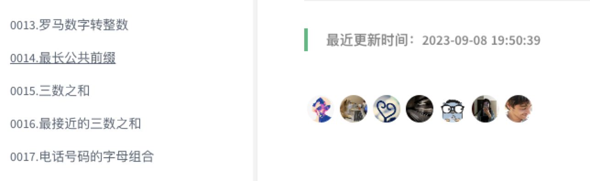
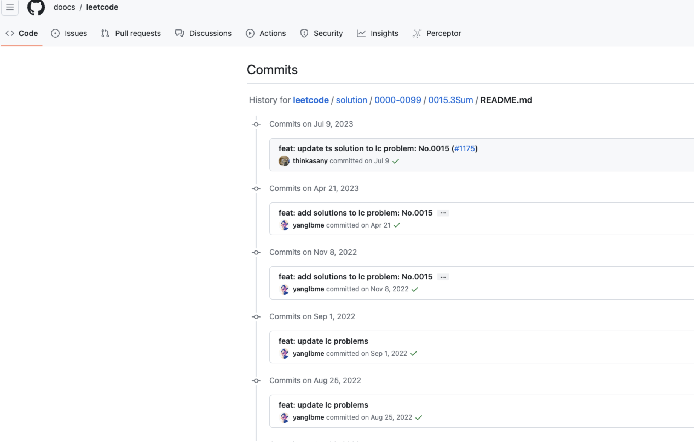

# 自我介绍
docsify插件: 最后一次编辑时间

使用`Minify`压缩

# [npm](https://www.npmjs.com/package/docsify-lastmodified)


# 🍔配置
```
repo: 'doocs/advanced-java'
lastModifiedText: '最近更新时间：'
```

# 🔗 CDN 
https://cdn.jsdelivr.net/npm/docsify-lastmodified/index.min.js

https://cdn-doocs.oss-cn-shenzhen.aliyuncs.com/npm/docsify-lastmodified/index.min.js

# 🇺🇳 国际化
```
const isEn = () => location.hash.includes('README_EN');
lastModifiedText: isEn() ? 'Last updated: ' : '最近更新时间：',
```

# 🚀谁在用我
| # | 仓库| 描述 | 热度 |
| --- | --- | --- | --- |
| 1   | [Doocs/leetcode](https://github.com/doocs/leetcode)           |     😏 LeetCode solutions in any programming language  多种编程语言实现 LeetCode、《剑指 Offer（第 2 版）》、《程序员面试金典（第 6 版）》题解       | <br> 
| 2   | [advanced-java](https://github.com/doocs/advanced-java)           |     😮 Core Interview Questions & Answers For Experienced Java(Backend) Developers 互联网 Java 工程师进阶知识完全扫盲：涵盖高并发、分布式、高可用、微服务、海量数据处理等领域知识       | <br>  

# 🌈 实现效果
显示最后更新时间

跳转至文件的历史commit记录
